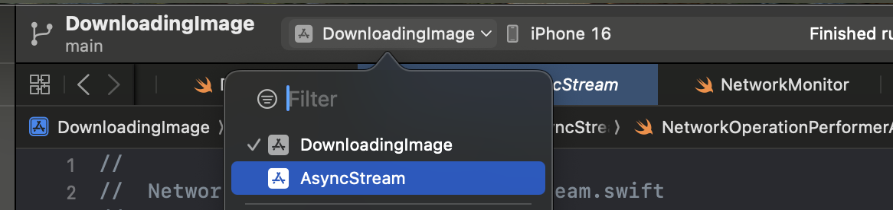
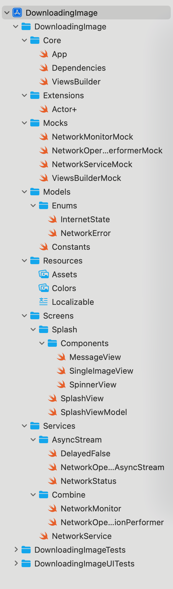

# SampleSwiftUI
A sample project that uses SwiftUI and the MVVM architecture.

What does the app do?
The app downloads an image from the internet and displays it.
If there is no internet connection, the app shows an appropriate message.
If the internet connection is restored within 5 seconds after the app starts, the image is loaded.

Functions of NetworkOperationPerformer:
- Executes arbitrary code when there is an internet connection.
- Executes arbitrary code if the internet connection is restored within a specified time interval.
- Returns an appropriate parameter if the internet connection is not restored within the specified time interval.

## Implementation Details
NetworkOperationPerformer is implemented using two approaches:

1.	The first implementation uses the Combine framework.
2.	The second implementation uses AsyncStream and TaskGroup.

Using two schemes, you can switch between the two approaches.

## Project structure

## License
Copyright huynguyencong,  Licensed under the MIT license.
